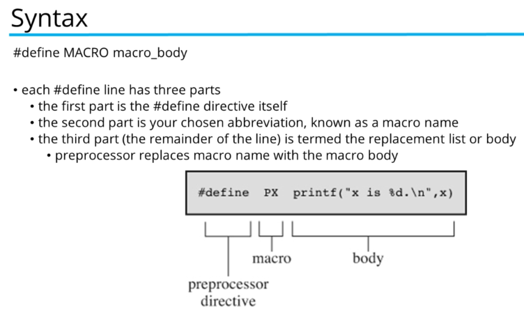

# Macros



#### should always use capital letters for macro functions and there are no spaces in names and its limited to one line only.

example:

```
#define PI 3.14

#define PRNT(a, b))\
printf("value1 = %d\n",a); \
printf("value2 = %d\n", b);

int main() {
int x = 2;
int y = 3;
PRNT(x, y);
return 0;
}
```

## macros VS functions

• all macros are preprocessed which means all of them would be processed before your program compiles. functions are not preprocessed, they are compiled.

• a macro is always faster than a function, functions take longer than inline code (macros for example).

• for one time use a macro is not really a big deal but a macro inside a nested loop is a much better candidate for speed improvements. we can use profilers to determine where a program spends the most time.

• when calling a function it has to a,locate some data (a newly allocated stack frame). macros don't have this overhead. macros insert directly into the program (textual program) so if we use the same macro 20 times we get 20 lines of code added into our program. functions are preferred over macros when writing large chunks of code

• with macros you don't have to worry about variable types

• functions give us type checking. if a function expects a string but you give it an int, you will get an error.

• debugging a macro is much harder than debugging a function. a function can be stopped through by the debugger but a macro cannot.

### alternatives

inline functions are the best alternative to macros. when we add the inline keyword in front of the function it hints the compiler to embed the function body inside the caller (just like a macro).

inline functions can be debugged and also have type checks.however the inline keyword is just a hint and not a strict rule.

## Creating macros

#### there are 2 ways of definingmacros:

#### 1. symbolic constants (constants represented as symbols)

#### 2. function macros (operations defined as symbols)

### Symbolic constants

example:

```
#define NONFMAC some text here
```

defines a macro and some replacement text. after definition the macro can be used as follows:

```
NOMAC
/* some text here */
```

leading or trailing white space around the replacement text is discarded

example:

```
#include <stdio.h>
#define NOMAC 12

int main(){
    printf("%d\n",NOMAC);
    return 0;
}
```

### Function macros

example:

```
#define FMAC(a,b) a here, then b

#define macro_name(list_of_identifiers)substitution_string
```

defines a macro and some replacement text. the list of identifiers seperated by commas aperas between parentheses following the macro\_name(FMAC). each identifier can apear one or more times in the substitution string

using:

```
FMAC(first text, some text)
```

example:

```
#include <stdio.h>

#define Warning(...) fprintf(stderr, __VA_ARGS__)

int main() {
    Warning("%s: this program is here \n","json");
    return 0;
}
```

output:


## macros with arguments

example:

```
#include <stdio.h>
#define PI 3.14
#define CIRCLE_AREA(x) ((PI) * (x) * (x))

int main(){
    int c = 5;
    int area = CIRCLE_AREA(c + 2);
    area = PI * c + 2 * c + 2;
    printf ("area is %d\n",area);
 return 0;
}
```

## Standard C predefined macros

```
__FILE__  → represent the current file name (string)

__LINE__ → represents the current line number of the current source code (an integer constant)

__func__ → the name of any function when placed inside a function of the current file ( not part of the standard) 

__DATE__ → the date the source file was compiled ( a string of the format "Mmm dd yyyy" such as "jan 19 2002")

__TIME__ → the time the source file was compiled ( a string literal of the format "hh:mm:ss")

__STDC__ → used to indicate if the compiler supports standard C by returning value 1

__STDC_VERSION__ → expands to the C Standard’s version number, a long integer constant of the form yyyymmL where yyyy and mm are the year and month of the Standard version.The value 199409L signifies the 1989 C standard as amended in 1994

__cplusplus → is defined when the C++ compiler is in use.
```
