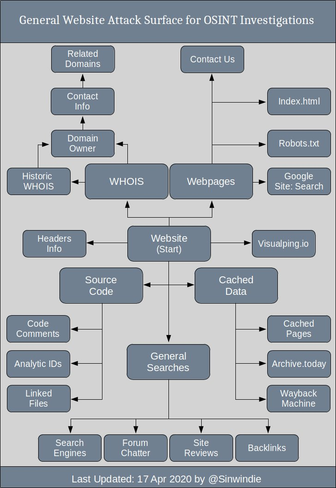
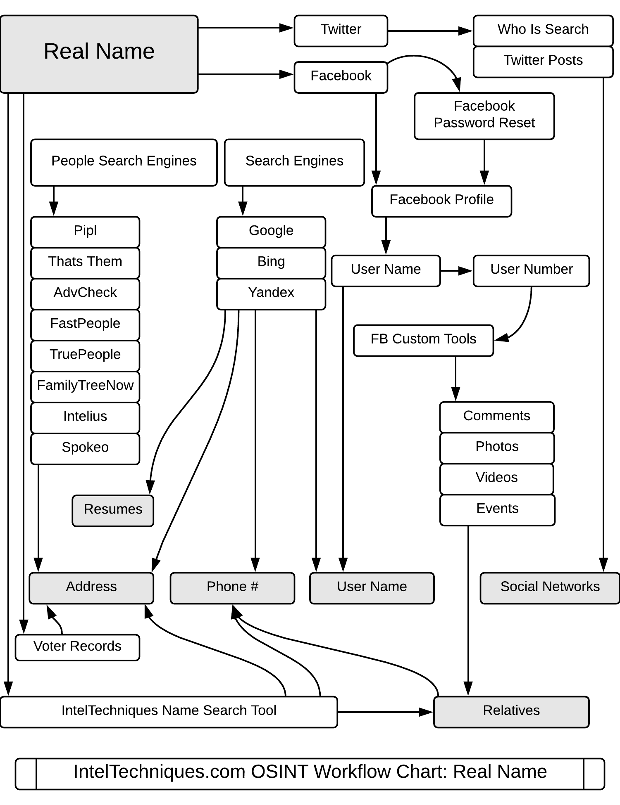
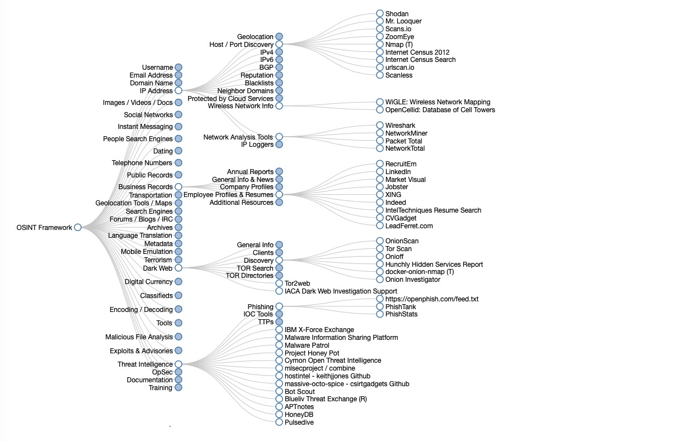

# Passive (OSINT)


#### OSINT  (short for Open-Source Intelligence Ghering)  is a way of knowing your target without any sorts of direct contact or leaving any evidence of the recon.


In OSINT you should **always ask questions like: how, who, when, where and why.** also try to **collect and sort everything you find and make a structured map** of the intel you have gathered using a mind mapping tool like [XMind](https://www.xmind.net) or [Mind Master](https://www.mindmaster.io).


#### OSINT reconnaissance can be further broken down into the following 5 sub-phases:


**Source Identification**: as the starting point, in this initial phase the attacker identifies potential sources from which information may be gathered from. Sources are internally documented throughout the process in detailed notes to come back to later if necessary.

**Data Harvesting**: in this phase, the attacker collects and harvests information from the selected sources and other sources that are discovered throughout this phase.

**Data Processing and Integration**: during this phase, the attacker processes the harvested information for actionable intelligence by searching for information that may assist in enumeration.

**Data Analysis**: in this phase, the attacker performs data analysis of the processed information using OSINT analysis tools.

**Results Delivery**: in the final phase, OSINT analysis is complete and the findings are presented/reported to other members of the Red Team.

## Workflow

### Domain

.png>)

### Website



### Email

.JPG>)

### Location


### Username / Real Name



### Phone


## Maltego

is an open source intelligence (OSINT) and graphical link analysis tool for gathering and connecting information for investigative tasks. its preinstalled in kali linux. you can download it from [here](https://www.maltego.com)


## DNS Harvesting







## Email Harvesting







## Google Hacking


also named Google dorking, is a hacker technique that uses Google Search and other Google applications to find security holes in web applications, finding loots, targeting databases, login pages or even exposed backup files and directories.

### **Google Dorks**

#### there is an expanding database of these search queries maintained by offensive security folks called the [google hacking database (GHDB) ](https://www.exploit-db.com/google-hacking-database). you can use the site search to find dorks for specific types of targets.



### Automated Dork Tools

[GoogD0rker](https://github.com/ZephrFish/GoogD0rker/)

```
./googD0rker-txt.py -d example.com
```

[Goohak](https://github.com/1N3/Goohak)

```
./goohak domain.com
```

[Pagado](https://github.com/opsdisk/pagodo)

```
# first run the scrapper to get the dorks and store them
python3 ghdb_scraper.py -j -s

# then run the tool to use gathered dorks
# -d option can be used to target a domain
python3 pagodo.py -d example.com -g dorks.txt -l 50 -s -e 35.0 -j 1.1
```

### Advanced Search Keywords&#x20;

besides the google dorks which are more advanced, there are some google search tricks (keywords) that will make your life easier. these are the keywords used in advanced google search**e**s:

#### **cache:**&#x20;

If you include other words in the query, Google will highlight those words within the cached document. For instance, \[cache:www.google.com web] will show the cached content with the word “web” highlighted. This functionality is also accessible by clicking on the “Cached” link on Google’s main results page. The query \[cache:] will show the version of the web page that Google has in its cache. For instance, \[cache:www.google.com] will show Google’s cache of the Google homepage. Note there can be no space between the “cache:” and the web page url.

#### **link: **

The query \[link:] will list webpages that have links to the specified webpage. For instance, \[link:www.google.com] will list webpages that have links pointing to the Google homepage. Note there can be no space between the “link:” and the web page url.

**related: **

The query \[related:] will list web pages that are “similar” to a specified web page. For instance, \[related:www.google.com] will list web pages that are similar to the Google homepage. Note there can be no space between the “related:” and the web page url.

#### **info:**&#x20;

The query \[info:] will present some information that Google has about that web page. For instance, \[info:www.google.com] will show information about the Google homepage. Note there can be no space between the “info:” and the web page url.

#### **define:**

&#x20;The query \[define:] will provide a definition of the words you enter after it, gathered from various online sources. The definition will be for the entire phrase entered (i.e., it will include all the words in the exact order you typed them).

#### **stocks:**

&#x20;If you begin a query with the \[stocks:] operator, Google will treat the rest of the query terms as stock ticker symbols, and will link to a page showing stock information for those symbols. For instance, \[stocks: intc yhoo] will show information about Intel and Yahoo. (Note you must type the ticker symbols, not the company name.)

#### **site:**&#x20;

If you include \[site:] in your query, Google will restrict the results to those websites in the given domain. For instance, \[help site:www.google.com] will find pages about help within www.google.com. \[help site:com] will find pages about help within .com urls. Note there can be no space between the “site:” and the domain.

#### **allintitle:**

** **If you start a query with \[allintitle:], Google will restrict the results to those with all of the query words in the title. For instance, \[allintitle: google search] will return only documents that have both “google” and “search” in the title.

#### **intitle: **

If you include \[intitle:] in your query, Google will restrict the results to documents containing that word in the title. For instance, \[intitle:google search] will return documents that mention the word “google” in their title, and mention the word “search” anywhere in the document (title or no). Note there can be no space between the “intitle:” and the following word. Putting \[intitle:] in front of every word in your query is equivalent to putting \[allintitle:] at the front of your query: \[intitle:google intitle:search] is the same as \[allintitle: google search].

#### **inurl:**

&#x20;If you include \[inurl:] in your query, Google will restrict the results to documents containing that word in the url. For instance, \[inurl:google search] will return documents that mention the word “google” in their url, and mention the word “search” anywhere in the document (url or no). Note there can be no space between the “inurl:” and the following word. Putting “inurl:” in front of every word in your query is equivalent to putting “allinurl:” at the front of your query: \[inurl:google inurl:search] is the same as \[allinurl: google search].

#### and these are some simple rules for combining the queries and dorks as well:

OR : ( | )

AND: (&)

NOT

define : define a word or phrase

## Github Dorks

we can use github advanced search keywords and dorks to find sensitive data in repositories.


Github dorks work with filenames and extentions


```
filename:bashrc
extension:pem
langage:bash
```

some examples of github search keywords:

```
extension:pem private # Private SSH Keys
extension:sql mysql dump # MySQL dumps
extension:sql mysql dump password # MySQL dumps with passwords
filename:wp-config.php # Wordpress config file
filename:.htpasswd # .htpasswd
filename:.git-credentials # Git stored credentials
filename:.bashrc password # .bashrc files containing passwords
filename:.bash_profile aws # AWS keys in .bash_profiles
extension:json mongolab.com # Keys/Credentials for mongolab
HEROKU_API_KEY language:json # Heroku API Keys
filename:filezilla.xml Pass # FTP credentials
filename:recentservers.xml Pass # FTP credentials
filename:config.php dbpasswd # PHP Applications databases credentials
shodan_api_key language:python # Shodan API Keys (try others languages)
filename:logins.json # Firefox saved password collection (key3.db usually in same repo)
filename:settings.py SECRET_KEY # Django secret keys (usually allows for session hijacking, RCE, etc)
```

## PGP Public Key Servers

Organizations maintain servers that provide public PGP keys to clients. You can query these to reveal user email addresses and details.







## CloadFlare / Tor IP Detection

some tips to find real IP addresses hiding behind CloadFlare and Tor



## Identify Host Sharing

see if a single server or ip is hosting multiple websites/domains:

```
# Bing dorks to identify host sharing
ip:xxx.xxx.xxx.xxx
```

## Shodan


Search engine for the Internet of everything. Shodan is the world's first search engine for Internet-connected devices including computers, servers, CCTV cameras, SCADA systems and everything that is connected to the internet with or without attention. Shodan can be used both as a source for gathering info about random targets for mass attacks and a tool for finding weak spots in a large network of systems to attack and take the low-hanging fruit. Shodan has a free and commercial membership and is accessible at [shodan.io](https://www.shodan.io) . the search syntax in the search engine is somehow special and can be found in the help section of the website. with shodan you can search for specific systems, ports, services, regions and countries or even specific vulnerable versions of a software or OS service running on systems like SMB v1 and much more.

&#x20;here the keywords that are mostly used in shodan search queries:

```
title: Search the content scraped from the HTML tag
html: Search the full HTML content of the returned page
product: Search the name of the software or product identified in the banner
net: Search a given netblock (example: 204.51.94.79/18)
version: Search the version of the product
port: Search for a specific port or ports
os: Search for a specific operating system name
country: Search for results in a given country (2-letter code)
city: Search for results in a given city
! : NOT
```

for example these are some queries you can use with these keywords:

```
hostname:megacorpone.com
title:"smb" !port:139,445
product:IIS 8.5
Microsoft-IIS/5.0 title:"outlook web"
net:100.10.23.0/24 unauthorized
html:"eBay Inc. All Rights Reserved"
"Authentication: disabled" port:445
shodan count microsoft iis 6.0
shodan host 189.201.128.250
shodan myip
shodan parse --fields ip_str,port,org --separator , microsoft-data.json.gz 
shodan search --fields ip_str,port,org,hostnames microsoft iis 6.0
```

there are several other ways to use the search engine without the website for example with the nmap NSE scripts like this:

```
  nmap -sn -Pn -n --script=shodan-api -script-args shodan-api.apikey=[api key] [target ip]
```

there is also a CLI shodan interface written in python for linux which you can use or integrate in your own scripts or tools. to install and setup the CLI tool:

```
   pip install shodan
   shodan init <api key>
   shodan -h
```

you can use the CLI tool by simply specifying a single host/IP:

```
shodan host [target ip]
```

shodan will return ports, services and even some possible CVEs  ( which are not very reliable ).

for the free API keys you cant use the same method to scan a whole net block but with some bash voodoo you can use the free API instead of paid ones to scan the whole /24 net block this way and see if any systems on this net block is exposed :

```
for host in {1..254}; do shodan host 192.168.1.$host 2>&1 | grep -v "Error" ; done
```

and if you want to aggressively scan a /16 net block you can do this:

```
 for netblock in {1..254};do for host in {1..254}; do shodan host 192.168.$netblock.$host 2>&1 | grep -v "Error" ; done ; done
```

and here are some other useful resources about shodan:

[https://www.sans.org/blog/getting-the-most-out-of-shodan-searches](https://www.sans.org/blog/getting-the-most-out-of-shodan-searches/)\
[https://thor-sec.com/cheatsheet/shodan/shodan\_cheat\_sheet](https://thor-sec.com/cheatsheet/shodan/shodan\_cheat\_sheet/)\
[https://github.com/jakejarvis/awesome-shodan-queries](https://github.com/jakejarvis/awesome-shodan-queries)

## OSINT Framework

[the OSINT framework](https://osintframework.com) is a great collection of OSINT resources that you should definitely check them out.



## Credential Leaks

Tools and resources for credential leaks available online:













## Social Media Investigation

For more in dept social search check the [social platforms page](social-platforms/).

## Other OSINT Websites

I have put together a list of the most used OSINT sources that will usually cover about 90% of your needs in  a regular pentest. remember there are endless ways to find Intel about your target. the OSINT process is limited to your own imagination.&#x20;

### Top sources ( most used )

#### [Skip Tracing Framework (kind of all-in-one directory for recon)](https://makensi.es/stf/)   [Robtex (search for IPs, domain names, etc )](https://www.robtex.com)   [Netcraft (very useful for website and domain recon)](https://searchdns.netcraft.com)   [SSL labs (test websites and domains SSL cert security)](https://www.ssllabs.com/ssltest)   [Security Headers (test website headers (browser plugin is available)](https://securityheaders.com)   [Archive.org (the largest Internet archive)](https://archive.org)   [iseek (not as deep as others but still useful)](https://www.iseek.com)   [Global file search (search for any file, used for passive metadata search )](http://globalfilesearch.com)   [NSLookup (query DNS records, both web and CLI tool )](https://network-tools.com/nslookup/)   [DNSdumpster (great for DNS recon)](https://dnsdumpster.com)   [Whois (both web and CLI tool )](https://www.whois.net)   [ONYPHE (internet SIEM website, that's what they call themselves )](https://www.onyphe.io) 


### Image search

#### [TinEye ( reverse image search )](https://tineye.com)   [photo bucket ( image search )](https://photobucket.com)

####

### Username and people search

#### &#x20; [User search ( search for usernames, mostly social media networks )](https://usersearch.org)   [Thats them](https://thatsthem.com)   [pipi ( investigation and research, you should sign up for it )](https://pipl.com)   [Social mention ( social media search )](http://socialmention.com)   [Social searcher ( social media search )](https://www.social-searcher.com)   [SPOKEO ( name, phone number, address, etc. )](https://www.spokeo.com)   [Find people search ( people search )](http://www.findpeoplesearch.com)   [Social bearing](https://www.socialbearing.com)   [TwimeMachine](https://www.twimemachine.com)

### &#x20;IOT and device search

#### [shodan ( search engine for internet connected devices, command line )](https://www.shodan.io)  [open stream cam ( open stream camera )](file:///root/work/w4lk3rn3t/recon/osint/index.html)  [insecam ( live video camera search )](file:///root/work/w4lk3rn3t/recon/osint/index.html)

####

### Dark web engines

#### pubpeer.com

scholar.google.com

arxiv.org

guides.library.harvard.edu

deepdotweb.com

Core.onion

OnionScan

Tor Scan

ahmia.fi

not evil


### &#x20;Monitoring and alerting

Google Alerts

HaveIBeenPwned.com

Dehashed.com

Spycloud.com

Ghostproject.fr

weleakinfo.com/



## Tools and Frameworks

#### There are countless number of tools out there designed for active/passive recon. you wont need to know about every single one of them because most of them use the same techniques for gathering these information. in this section i will briefly introduce you to the best/well-known tools that i usually use:


### Theharvester

a well-known tool among pentesters and OSINT investigators which is mostly good for collecting subdomains and email addresses.



harvester is preinstalled on pentesting OSs like kali and parrot but for others you can install it from github and run it in docker:

```
apt install theharvester
Theharvester --help
```

```
git clone https://github.com/laramies/theHarvester
cd theHarvester
docker build -t theharvester .
docker run theharvester -h 
```

### h8mail

An email OSINT and breach hunting tool using different breach and reconnaissance services, or local breaches such as Troy Hunt's "Collection1" and the infamous "Breach Compilation" torrent.



```
python3 -m pip install h8mail

h8mail -t target@example.com
```


### gitrob

a tool to help find potentially sensitive files pushed to public repositories on Github. Gitrob will clone repositories belonging to a user or organization down to a configurable depth and iterate through the commit history and flag files that match signatures for potentially sensitive files. The findings will be presented through a web interface for easy browsing and analysis.




### inspy

LinkedIn enumeration tool. preinstalled on kali.



```
inspy --empspy /usr/share/inspy/wordlists/title-list-large.txt --emailformat flast@google.com 'Google'

--email format is how the emails work

inspy --empspy /usr/share/inspy/wordlists/title-list-large.txt --emailformat

```

### amass

In-depth Attack Surface Mapping and Asset Discovery, preinstalled on kali. The OWASP Amass Project performs network mapping of attack surfaces and external asset discovery using open source information gathering and active reconnaissance techniques.



run the help to see the options:

```
amass --help
```


### spiderfoot

an open source intelligence (OSINT) automation tool. It calmes to integrate with just about every data source available and utilities a range of methods for data analysis, making that data easy to navigate.



```
spiderfoot -l 127.0.0.1:5001  → run web GUI on local host, connect with browser
```


### recon-ng

By far, the best recon framework out there with both active and passive modules. designed like metasploit framework and each type of recon has its own specific module and options. the modules are installed from the "marketplace" plus a bunch of reporting modules for different formats. recon-ng is preinstalled on kali linux and parrot OS.



you can see the full ocumentation in the wiki:



here are some of the useful commands for a quick start:

```
help >>> help
marketplace install/search/info [modules names] >>> add or search for a module
modules load [module] >>> load a module
info >>> show module options
options set >>> set module options
run >>> run the module
```

to install all recon modules at once:

```
marketplace install recon/
```

some modules need api keys add it with :

```
e.g: shodan for example keys add shodan_api <API>
show keys — list available API keys
keys add api_key_name #api_key_value →  add key to module
```

a list of modules i usually use:

```
recon/domains-domains/brute_suffix 
recon/domains-hosts/bing_domain_web  
recon/domains-hosts/brute_hosts
recon/domains-hosts/netcraft
recon/domains-hosts/ssl_san
recon/hosts-hosts/bing_ip
recon/domains-hosts/hackertarget
recon/netblocks-hosts/reverse_resolve       → find hosts in a netblock
recon/hosts-hosts/reverse_resolve
discovery/info_disclosure/cache_snoop       → useful for finding AVs in use
```


### Sherlock

find user accounts on social media



```
git clone https://github.com/sherlock-project/sherlock.git

cd sherlock
python3 -m pip install -r requirements.txt
python3 sherlock --help
python3 sherlock user1 user2 user3
```


### TWINT

advanced Twitter scraping tool written in Python that allows for scraping Tweets from Twitter profiles without using Twitter's API.




### social-analyzer

for analyzing and finding a person's profile across +800 social media  websites

```
python3 -m pip install social-analyzer

social-analyzer --username "johndoe" --metadata --extract --mode fast
```

## Other Tools

```
# Firefox and some plugins
- Download Star
- ExifViewer
- Firefox multiaccount
- HTTPS Everywhere
- Image Search Options
- MJsonViewer
- Nimbus Screen Capture
- Resurrect Pages
- Take Webpage Screenshots Entirely
- uBlock Origin
- User-Agent Switcher
- Video DownloadHelper

# Google Chrome with other plugins

# TOR Browser

# Custom Video Manipulation Utilities

# Custom Video Download Utility


# BleachBit
→ Clean your PC


# EmailHarvester
→ Collect emails using search engines


# Exiftool
→ Extract metadata from images


# EyeWitness
→ Take screenshots from website
→ Get HTTP headers
→ Identify some credentials
→ Basic tool semi passive


# Ghiro
→ Ghiro is a fully automated tool designed to run forensics analysis over a massive amount of images
→ Just using an user friendly and fancy web application. 


# GIMP
→ Image manipulation tool


# Google Earth Pro
→ Advanced Google Earth
→ Browse and create maps


# HTTrack Cloner
→ Copy website locally
→ It downloads website content and rebuild the file structure


# InstaLooter
→ API-less Instagram pictures and videos downloader


# KeePassXC
→ Keepass Cross Platform Community Edition


# Kleopatra
→ Kleopatra is a certificate manager and GUI for GnuPG


# Knock Pages
→ Subdomain bruteforce
→ Virustotal, wildcard, zone transfer
→ Using a wordlist


# LibreOffice
→ Known one


# LinkedInt
→ LinkedIn Intelligence
→ Find emails, companies etc


# Metagoofil
→ Extracting metadata of public documents (pdf,doc,xls,ppt,etc) availables in the target websites


# MediaInfo
→ Complete tool used to get information about local files
→ Metada etc


# Metadata anonymisation Toolkit
→ Small tool used to anonymise file\'s metadata


# PhoneInfoga
→ Information gathering & OSINT reconnaissance tool for phone numbers
→ Scan phone numbers using only free resources
→ The goal is to first gather standard information such as country, area, carrier and line type on any international phone numbers
→ Then search for footprints on search engines to try to find the VoIP provider or identify the owner
→ Features
   ⇒ Check if phone number exists and is possible
   ⇒ Gather standard informations such as country, line type and carrier
   ⇒ OSINT footprinting using external APIs, Google Hacking, phone books & search engines
   ⇒ Check for reputation reports, social media, disposable numbers and more
   ⇒ Scan several numbers at once
   ⇒ Use custom formatting for more effective OSINT reconnaissance
   ⇒ Automatic footprinting on several custom formats


# Photon
→ Photon is a fast OSINT web crawler which can retrieve the following data for a target : 
→ URLs (in-scope & out-of-scope)
→ URLs with parameters (example.com/gallery.php?id=2)
→ Intel (emails, social media accounts, amazon buckets etc.)
→ Files (pdf, png, xml etc.)
→ Secret keys (auth/API keys & hashes)
→ JavaScript files & Endpoints present in them
→ Strings matching custom regex pattern
→ Subdomains & DNS related data


# ReconDog
→ Recon Dog is an all in one tool for all your basic information gathering needs.
→ It uses APIs to gather all the information so your identity is not exposed.
→ Simple and basic standalone python script
→ All informations seems to be extracted from API\'s services, so it fully passive


# SkipTracer
→ It uses some basic python webscraping to compile passive information on a target
→ Included modules will allow queries for the following :
   ⇒ Phone
   ⇒ Email
   ⇒ Screen names
   ⇒ Real names
   ⇒ Addresses
   ⇒ IP
   ⇒ Hostname
   ⇒ Breach Credentials

# SocialMapper

# StegoSuite
→ Free and open source steganography tool written in Java.
→ With Stegosuite you can easily hide information in image files.


# SubBrute
→ A DNS meta-query spider that enumerates DNS records, and subdomains.         
→ Subdomain bruteforce


# Tinfoleak
→ The most complete open-source tool for Twitter intelligence analysis
→ UI tool


Twitter Exporter
→ ???


VeraCrypt
→ Known one, encryption


VLC
→ Known one, video


Yubico Utilities
→ tools for using yubikeys
```

