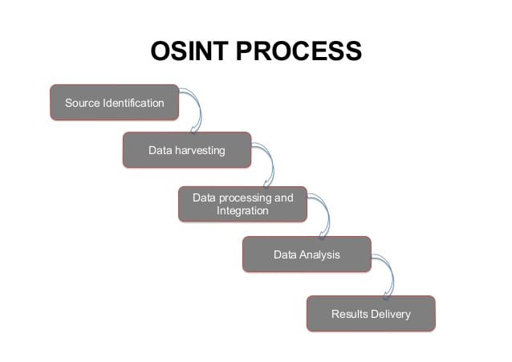

# OSINT

#### OSINT is short for Open-Source Information Gathering, OSINT is a way of foot printing your target without any sorts of direct contact or leaving any evidence of the recon process.

#### simply put, OSINT means finding info without leaving any info. there are some ways to perform active info gathering without being traced for example using tor or double VPNs or even passive methods like using a public network but we will talk about those in the scanning phase, right now lets jump into some resources for OSINT.

besides OSINT there are other methods and techniques out there that are no longer used. there is an almost endless variety and number of sources available out there. **Signals Intelligence \(SIGINT\)** is no longer interesting or relevant since satellite communications are insignificant these days. **Image Intelligence \(IMINT\)** is something anybody can do with modern drones. Books are outdated and have been replaced with e-book readers and other mobile electronic devices. Overall, other communication channels have taken over, new kinds and types of sources pop up almost every day, many of those requiring technical skills to make use of them. Many, if not most, of the possible relevant sources are completely unknown to intelligence analysts. Finding and using sources is today’s task for specialists.

Due to the vast amounts of information available to sift through on the Web, attackers must have a clear and defined search framework as well as a wide array of OSINT collection tools to facilitate this task and assist with processing the data; otherwise they risk getting lost in the overwhelming sea of information that has become the Internet. 

### OSINT reconnaissance can be further broken down into the following 5 sub-phases:

**Source Identification**: as the starting point, in this initial phase the attacker identifies potential sources from which information may be gathered from. Sources are internally documented throughout the process in detailed notes to come back to later if necessary.

**Data Harvesting**: in this phase, the attacker collects and harvests information from the selected sources and other sources that are discovered throughout this phase.

**Data Processing and Integration**: during this phase, the attacker processes the harvested information for actionable intelligence by searching for information that may assist in enumeration.

**Data Analysis**: in this phase, the attacker performs data analysis of the processed information using OSINT analysis tools.

**Results Delivery**: in the final phase, OSINT analysis is complete and the findings are presented/reported to other members of the Red Team.

