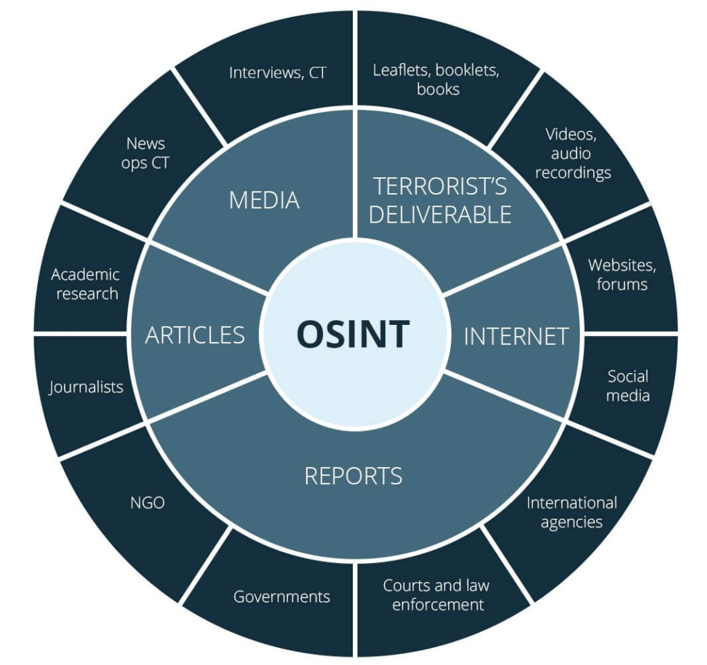
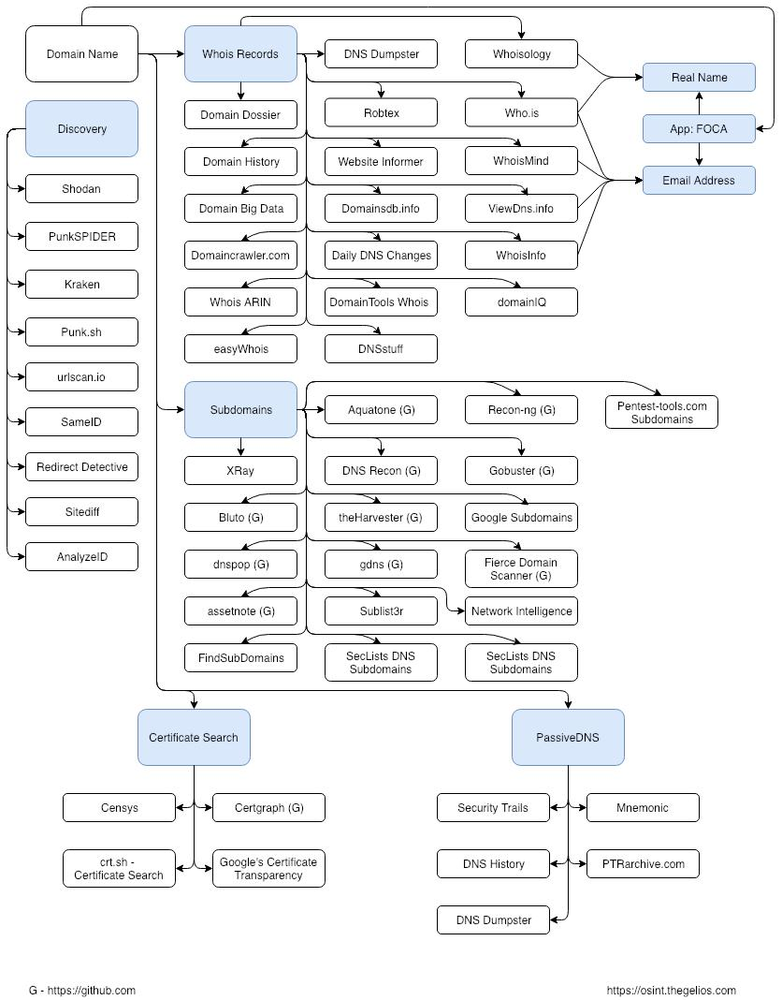
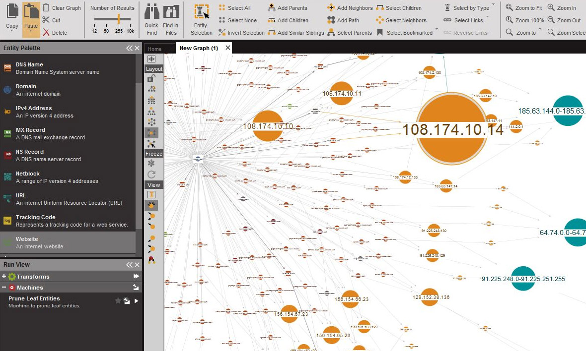

# OSINT

#### OSINT is short for Open-Source Information Gathering, OSINT is a way of foot printing your target without any sorts of direct contact or leaving any evidence of the recon process.

#### simply put, OSINT means finding info without leaving any info. there are some ways to perform active info gathering without being traced for example using tor or double VPNs or even passive methods like using a public network but we will talk about those in the scanning phase, right now lets jump into some resources for OSINT.

besides OSINT there are other methods and techniques out there that are no longer used. there is an almost endless variety and number of sources available out there. **Signals Intelligence \(SIGINT\)** is no longer interesting or relevant since satellite communications are insignificant these days. **Image Intelligence \(IMINT\)** is something anybody can do with modern drones. Books are outdated and have been replaced with e-book readers and other mobile electronic devices. Overall, other communication channels have taken over, new kinds and types of sources pop up almost every day, many of those requiring technical skills to make use of them. Many, if not most, of the possible relevant sources are completely unknown to intelligence analysts. Finding and using sources is today’s task for specialists.

Due to the vast amounts of information available to sift through on the Web, attackers must have a clear and defined search framework as well as a wide array of OSINT collection tools to facilitate this task and assist with processing the data; otherwise they risk getting lost in the overwhelming sea of information that has become the Internet. 

### OSINT reconnaissance can be further broken down into the following 5 sub-phases:

**Source Identification**: as the starting point, in this initial phase the attacker identifies potential sources from which information may be gathered from. Sources are internally documented throughout the process in detailed notes to come back to later if necessary.

**Data Harvesting**: in this phase, the attacker collects and harvests information from the selected sources and other sources that are discovered throughout this phase.

**Data Processing and Integration**: during this phase, the attacker processes the harvested information for actionable intelligence by searching for information that may assist in enumeration.

**Data Analysis**: in this phase, the attacker performs data analysis of the processed information using OSINT analysis tools.

**Results Delivery**: in the final phase, OSINT analysis is complete and the findings are presented/reported to other members of the Red Team.

for example in the picture bellow you see a sample OSINT chart for a domain enumeration:

so first we start with well known sources and tools and then go for additional options:

## Maltego

is an open source intelligence \(OSINT\) and graphical link analysis tool for gathering and connecting information for investigative tasks. its preinstalled in kali linux. you can download it from [here](https://www.maltego.com/)

## OSINT Framework

[the OSINT framework](https://osintframework.com/) is a great collection of OSINT resources that you should definitely check them out.

## Websites and popular online OSINT sources

I have put together a list of the most used OSINT sources that will usually cover about 90% of your needs in  a a regular pentest, remember there are endless ways to find Intel about your target. the OSINT process is limited to your own imagination. 

### 1\) Top sources \( most used \)

#### [Skip Tracing Framework \(kind of all-in-one directory for recon\)](https://makensi.es/stf/)   [Robtex \(search for IPs, domain names, etc \)](https://www.robtex.com/)   [Netcraft \(very useful for website and domain recon\)](https://searchdns.netcraft.com/)   [SSL labs \(test websites and domains SSL cert security\)](https://www.ssllabs.com/ssltest)   [Security Headers \(test website headers \(browser plugin is available\)](https://securityheaders.com)   [Archive.org \(the largest Internet archive\)](https://archive.org/)   [iseek \(not as deep as others but still useful\)](https://www.iseek.com/)   [Global file search \(search for any file, used for passive metadata search \)](http://globalfilesearch.com/)   [NSLookup \(query DNS records, both web and CLI tool \)](https://network-tools.com/nslookup/)   [DNSdumpster \(greate for DNS recon\)](https://dnsdumpster.com/)   [Whois \(both web and CLI tool \)](https://www.whois.net)   [ONYPHE \(internet SIEM website, thats what they call themselves \)](https://www.onyphe.io/) 

### 2\) Image search

#### [TinEye \( reverse image search \)](https://tineye.com/)   [photo bucket \( image search \)](https://photobucket.com/)

#### 

### 3\) Username and people search

####   [User search \( earch for usernames, mostly social media networks \)](https://usersearch.org/)   [Thats them](https://thatsthem.com/)   [pipi \( investigation and research, you should sign up for it \)](https://pipl.com/)   [Social mention \( social media search \)](http://socialmention.com/)   [Social searcher \( social media search \)](https://www.social-searcher.com/)   [SPOKEO \( name, phone number, address, etc. \)](https://www.spokeo.com/)   [Find people search \( people search \)](http://www.findpeoplesearch.com/)   [Social bearing](https://www.socialbearing.com)   [TwimeMachine](https://www.twimemachine.com) 

#### 

### 4\) Metadata search

### [Archive.org](https://archive.org/)   [metapicz](http://metapicz.com/#landing)   [image forensic](http://www.imageforensic.org/)   [findexif](http://findexif.com/)   [exif regex](http://exif.regex.info/exif.cgi)

### 

### 5\) IOT and device search

#### [shodan \( search engine for internet connected devices, command line \)](https://www.shodan.io/)  [open stream cam \( open stream camera \)](file:///root/work/w4lk3rn3t/recon/osint/index.html)  [insecam \( live video camera search \)](file:///root/work/w4lk3rn3t/recon/osint/index.html)

####  

### 6\) Dark web engines

#### pubpeer.com

scholar.google.com

arxiv.org

guides.library.harvard.edu

deepdotweb.com

Core.onion

OnionScan

Tor Scan

ahmia.fi

not evil

### 7\) Monitoring and alerting

Google Alerts

HaveIBeenPwned.com

Dehashed.com

Spycloud.com

Ghostproject.fr

weleakinfo.com/



## Tools and Frameworks

